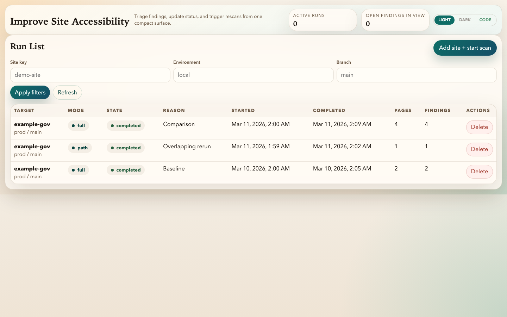
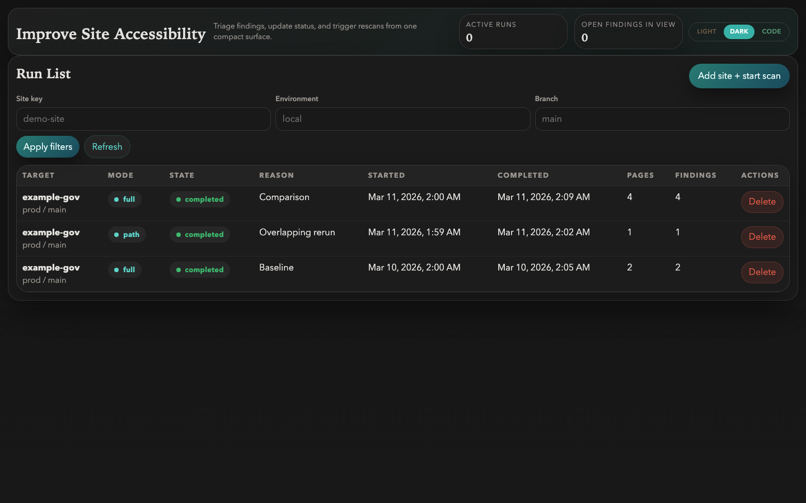
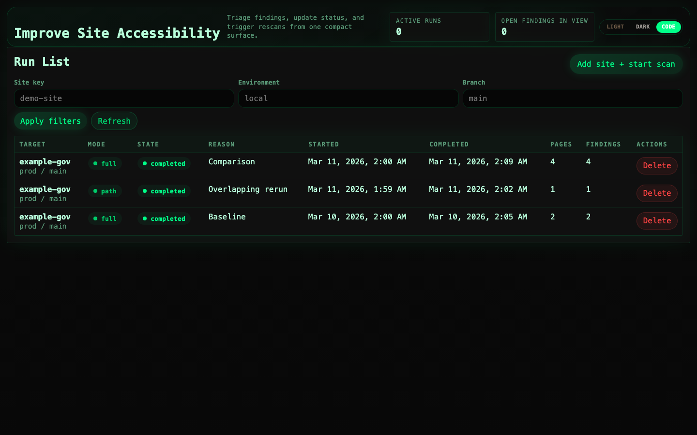

# WCAG-Guide

[](https://github.com/jesseslone/wcag-guide/actions/workflows/ci.yml)
[](LICENSE)

Accessibility compliance, together. You bring the expertise. Your AI agent brings the throughput.

WCAG-Guide is an open-source WCAG 2.1 scanner and remediation tracker designed so that you and your agentic coding tool work side by side. You review findings and make decisions in the dashboard. Your AI agent scans sites, triages issues, and triggers rescans through the MCP server. One workflow, two interfaces, no context-switching.

It's a self-hosted alternative to commercial platforms like Siteimprove, Deque, Level Access, and AudioEye — no per-seat pricing, no vendor lock-in, and no waiting on someone else's roadmap. Whether you're a government team working toward Title II compliance, a developer who cares about getting accessibility right, or an organization that just wants to ship inclusive software, WCAG-Guide gives you the tools to move fast and stay accountable.

> **[Documentation site](https://jesseslone.github.io/wcag-guide/)** -- Quickstart, architecture, MCP integration, and roadmap.



<details>
<summary>Dark and code themes</summary>




</details>

## Features

- **Automated WCAG scanning** -- Browser-based accessibility scans powered by axe-core and Playwright, with configurable compliance profiles (WCAG 2.1 A/AA).
- **Remediation dashboard** -- Web UI for reviewing findings, updating statuses, and tracking remediation progress across scan runs.
- **MCP server for AI agents** -- Expose scanning, triage, and remediation tools to LLM-based agents via the Model Context Protocol (stdio transport).
- **Compliance profiles** -- Built-in profiles for WCAG 2.1 Level A, AA, and AAA conformance targets.
- **High-Value Target (HVT) grouping** -- Findings grouped by rule, page, or path to prioritize the most impactful fixes.
- **Targeted rescans** -- Re-scan a single page, a URL path prefix, or the full site without re-running the entire crawl.
- **Diff-aware triage** -- Track new, fixed, and recurring findings across successive scan runs.

## Quick Start

Prerequisites: Docker and Docker Compose.

1. Start the full stack:

```sh
./scripts/dev/up.sh
```

2. Open the dashboard at `http://127.0.0.1:8080/dashboard`.

3. A bundled demo site is available at `http://127.0.0.1:8081` for testing scans locally.

4. Launch a scan against the demo site:

```sh
curl -fsS -X POST http://127.0.0.1:8080/scan-runs \
  -H "content-type: application/json" \
  -d '{"scan_target":{"site_key":"demo-site","environment":"local","branch":"main","base_url":"http://demo-site:8081"}}'
```

5. Stop the stack (scan data persists):

```sh
./scripts/dev/down.sh          # keeps database volume
./scripts/dev/down.sh --purge  # removes everything including scan data
```

## MCP Integration

WCAG-Guide includes an MCP server that exposes accessibility scanning and remediation tools to AI agents. This lets an LLM-based agent autonomously scan sites, triage findings, update statuses, and trigger rescans.

> **Prerequisite:** The local Docker Compose stack must be running (`./scripts/dev/up.sh`).

**Start the MCP server:**

```sh
# From the repo root (no global install required)
node bin/wguide.js mcp

# Or, after `npm link` from the repo root
wguide mcp

# Or, once published to npm
npx wcag-guide mcp
```

The MCP server targets the local API at `http://127.0.0.1:8080` by default. It can auto-bootstrap the Docker Compose stack if it is not already running (use `--no-bootstrap` to disable this).

**Available MCP tools:**

| Tool | Description |
|------|-------------|
| `list_compliance_profiles` | List supported WCAG compliance profiles |
| `list_scan_targets` | List registered scan targets |
| `upsert_scan_target` | Register or update a scan target |
| `get_target_overview` | Remediation summary for a target |
| `list_triage_queue` | Paginated finding queue with filters |
| `get_scan_run_summary` | Summary of a scan run |
| `get_scan_run_hvt_groups` | High-value target grouping for a run |
| `get_finding_detail` | Evidence and status history for a finding |
| `update_finding_status` | Update a finding's remediation status |
| `trigger_page_rescan` | Re-scan a single page |
| `trigger_path_rescan` | Re-scan all pages under a path prefix |
| `trigger_full_scan` | Launch a full-site scan |

**Configure in your MCP client:**

```json
{
  "mcpServers": {
    "wcag-guide": {
      "command": "node",
      "args": ["/absolute/path/to/wcag-guide/bin/wguide.js", "mcp"]
    }
  }
}
```

See `docs/local/mcp-bootstrap.md` for bootstrap configuration details.

## Architecture

The local stack runs four Docker Compose services:

| Service | Role |
|---------|------|
| **db** | PostgreSQL 16 -- stores targets, scan runs, findings, and remediation history |
| **app** | Node.js API server (port 8080) -- REST API and dashboard UI |
| **worker** | Queue-polling worker -- picks up scan jobs, runs axe-core via Playwright, persists results |
| **demo-site** | Bundled sample site (port 8081) for local testing |

The MCP server (`wguide mcp`) runs as a separate stdio process on the host and communicates with the app server over HTTP.

## Verification

```sh
# Unit and integration tests
npm test

# End-to-end dashboard test
npm run test:e2e

# Full lifecycle smoke test
./scripts/smoke/full-lifecycle.sh
```

## Known Limitations

See [KNOWN_LIMITATIONS.md](KNOWN_LIMITATIONS.md) for the current list, including:

- Authenticated/session-dependent sites are not yet supported.
- No sitemap-driven crawl seeding (scans start from the base URL).
- Dashboard does not include authentication or multi-user workflows.
- MCP transport is stdio only (no HTTP/SSE yet).
- Evidence capture is limited to selector, snippet, and URL (no screenshots).

## Troubleshooting

See [docs/local/troubleshooting.md](docs/local/troubleshooting.md).

## Contributing

See [CONTRIBUTING.md](CONTRIBUTING.md).

## License

MIT
